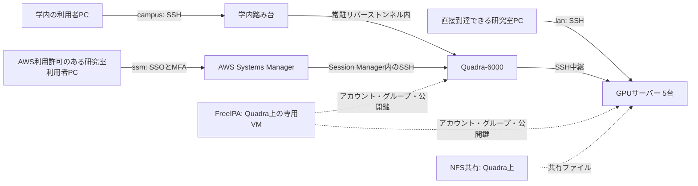

# システム全体と接続経路の選び方

この基盤は、**Quadra-6000を中核に、5台のGPUサーバーで共通のアカウントと共有ストレージを使う構成**です。利用者は、自分の利用許可と接続元ネットワークに合わせて `-lan`・`-campus`・`-ssm` を選びます。

`rtx5090-campus` と `rtx5090-ssm` は、同じRTX5090へ異なる経路で接続するための名前です。末尾を変えても、別のGPUや研究環境になるわけではありません。接続名はPCのSSH configに登録する別名で、設定前から使えるインターネットのホスト名ではありません。

## 1. 全体構成

実線は利用者のSSH接続経路、点線はサーバーが使う認証情報・共有ストレージを表します。



| 構成要素 | 役割 | 利用者に関係すること |
| --- | --- | --- |
| 学内踏み台 `www.ic.kanazawa-it.ac.jp` | `-campus` の入口 | 本人用の踏み台アカウントと公開鍵登録が必要 |
| Quadra-6000 `quadra.i2lab.test` | SSH中継、NFS共有、FreeIPA VMのホスト、SSMの接続先 | `-campus`・`-ssm` の両方が経由する |
| FreeIPA `ipa.i2lab.test` | 利用者名・グループ・UID/GID・SSH公開鍵を一元管理 | 管理者が公開鍵を本人のアカウントへ登録。Quadra・GPUはSSSDという仕組みで参照する |
| GPUサーバー5台 | GPU計算、研究環境・コンテナの実行 | 承認されたサーバーへ本人のFreeIPAアカウントでログインする |
| NFS共有 | Quadraのファイルを各GPUから利用する | GPU上では通知された `/mnt/nfs-shared/...` を使用する |
| AWS IAM Identity Center | `-ssm` 利用者のAWS認証と権限管理 | 個人アカウント・MFA・SSM利用権限が必要 |
| AWS Systems Manager（SSM） | AWS経由でQuadraまでの通信路を提供 | 計算を実行するGPUは研究室内にある。AWS上のGPUへ接続する構成ではない |

FreeIPAはSSHの中継先ではありません。利用者がFreeIPAサーバーへログインしてからGPUへ移動する必要はありません。

## 2. どの経路を選ぶか

| 比較項目 | `-lan` | `-campus` | `-ssm` |
| --- | --- | --- | --- |
| 対象者 | 研究室内利用者 | 研究室外の学内利用者・ゼミ生、および研究室内利用者 | AWS利用許可のある研究室内利用者 |
| 接続元の条件 | 対象GPUの `192.168.73.x:22` へ直接通信できる | 学内踏み台のSSH（TCP/22）へ通信できる | AWSの認証・SSMに必要な通信ができる。自宅・学外のほか学内でも利用可 |
| 経路 | PC → GPU | PC → 学内踏み台 → トンネル → Quadra → GPU | PC → AWS SSM → Quadra → GPU |
| FreeIPAアカウント・SSH鍵 | 必要 | 必要 | 必要 |
| 本人用の学内踏み台アカウント | 不要 | 必要 | 不要 |
| AWSアカウント・MFA・SSM権限 | 不要 | 不要 | 必要 |
| PCに必要なツール | OpenSSH | OpenSSH | OpenSSH、AWS CLI v2、Session Manager Plugin |
| 接続前のAWSログイン | 不要 | 不要 | `aws sso login --profile i2lab`（本人のprofile名に合わせる） |
| SSH設定の必須ブロック | 対象GPUの `-lan` | `campus-jump`、`quadra-campus`、対象GPUの `-campus` | `quadra-ssm`、対象GPUの `-ssm` |
| 詳細手順 | [直接接続](lan-user-guide.md) | [学内接続](campus-user-guide.md) | [SSM接続](remote-access-user-guide.md) |

研究室外の学内利用者にはAWS権限を発行しません。自宅から `-campus` を選ぶだけでは学内接続になりません。学内でもネットワークの分離によって到達できない場合があります。利用場所と必要な経路を申請時に伝えてください。

## 3. `-campus`：学内踏み台とリバーストンネル

設定後、自分のPCで `ssh rtx5090-campus` を実行すると、SSHが次の中継を自動で行います。

```text
自分のPC
  → campus-jump：学内踏み台のSSH（本人の踏み台ユーザー名）
  → 踏み台内部の 127.0.0.1:2222
  → 常駐トンネルを通ってQuadraのSSH（本人のFreeIPAユーザー名）
  → RTX5090のSSH（本人のFreeIPAユーザー名）
```

このトンネルを作る接続は、管理者の設定で **Quadra → 学内踏み台** の向きに張られています。踏み台側の入口 `127.0.0.1:2222` に来た通信を、その接続を通してQuadra側の `127.0.0.1:22` へ戻すため、「リバーストンネル」と呼びます。利用者がGPUへ進む向きと、トンネルを張る接続の向きは異なります。

`quadra-campus` の `HostName 127.0.0.1` と `Port 2222` は、**ProxyJump先の学内踏み台から見た宛先**です。自分のPCの2222番ポートではありません。GPUのIPやQuadraのIPへ書き換えないでください。`HostKeyAlias 192.168.73.98` は、このトンネルの接続先をQuadraのホスト鍵として照合するための設定です。

利用者は `ssh -R` の実行やサービスの起動を行いません。管理者がQuadraの `campus-tunnel.service` を維持します。トンネル維持用の専用鍵は利用者のSSH鍵とは別で、配布されません。

踏み台とFreeIPAは別のアカウント管理です。同じ本人の公開鍵を使う場合でも、管理者による両方への登録が必要です。踏み台の `User` には本人に通知された踏み台ユーザー名、Quadra・GPUの `User` には確定したFreeIPAユーザー名を設定します。

[学内用SSH設定例](../config/ssh_config.campus.example)に従えば、自分のPCから1回のコマンドで対象GPUへ接続できます。途中のサーバーへ手動ログインして次の `ssh` を打つ必要はありません。秘密鍵のコピーや `ssh -A` によるエージェント転送も不要です。

## 4. `-ssm`：AWS認証とSSH認証の二段階

SSMはAWS Systems Managerの略で、そのSession Manager機能をQuadraまでの通信路に使います。本構成のManaged Node（AWSに登録された接続先）は **Quadra** です。各GPUをSSMの直接接続先に指定する手順ではありません。

1. 自分のPCで `aws sso login --profile i2lab` を実行し、ブラウザで本人のAWSアカウントとMFAを使って認証する。
2. 同じPCで `ssh rtx5090-ssm` を実行する。
3. `quadra-ssm` の `ProxyCommand` がAWS CLIとSession Manager Pluginを使い、QuadraのSSHへの通信路を開く。
4. 本人の秘密鍵を使ってQuadraにSSH認証し、`ProxyJump` で対象GPUへ中継する。GPUへのSSH認証にも本人の鍵とFreeIPAアカウントを使う。

AWS認証は「SSMの通信路を使ってよいか」、SSH認証は「どの利用者としてQuadra・GPUへログインしてよいか」を確認します。**SSOログインに成功しても、FreeIPAアカウントや公開鍵登録がなければGPUへログインできません。** AWSユーザー名やメールアドレスをSSH configの `User` に書かないでください。

| 管理者から受け取る情報 | 設定する場所 |
| --- | --- |
| FreeIPAユーザー名・公開鍵登録完了 | SSH configの `__SSH_USER__`。秘密鍵は自分のPCのものを `__IDENTITY_FILE__` に指定 |
| Start URL・SSO region・AWS account・permission set | `aws configure sso --profile i2lab` の設定 |
| Quadra Managed Node ID（`mi-...`） | `quadra-ssm` の `__QUADRA_MANAGED_NODE_ID__` |
| SSM接続先リージョン（現構成：`ap-northeast-1`） | SSH configの `__AWS_REGION__` |
| 自分で設定したAWS CLI profile名 | SSH configの `__AWS_PROFILE__` と `aws sso login --profile` に同じ値を使う |

`i2lab` はこのガイドのAWS CLI設定名の例です。FreeIPAユーザー名とは別です。SSO regionとSSM接続先リージョンも別の設定項目なので、管理者の通知に従ってください。

[直接接続・AWS用SSH設定例](../config/ssh_config.example)と、[macOS](remote-access-macos-guide.md)・[Windows](remote-access-windows-guide.md)・[Ubuntu](remote-access-ubuntu-guide.md)の初期設定を使用します。SSM上のSSHにもSSH認証が必要な点は[AWS公式の説明](https://docs.aws.amazon.com/systems-manager/latest/userguide/session-manager-getting-started-enable-ssh-connections.html)に沿っています。

## 5. 接続先と共有ファイル

| 管理名 | ホスト名 | IPアドレス | GPU接続名の先頭 |
| --- | --- | --- | --- |
| Quadra-6000（中核・中継） | `quadra.i2lab.test` | `192.168.73.98` | `quadra` |
| RTX-A6000x2 | `a6000.i2lab.test` | `192.168.73.83` | `rtx-a6000x2` |
| AIsawa（RTX 6000 Ada搭載） | `aisawaminori.i2lab.test` | `192.168.73.213` | `aisawa` |
| RTX-6000ada | `rtx6000ada.i2lab.test` | `192.168.73.239` | `rtx-6000ada` |
| RTX4090 | `rtx4090.i2lab.test` | `192.168.73.134` | `rtx4090` |
| RTX5090 | `rtx5090.i2lab.test` | `192.168.73.163` | `rtx5090` |

接続名の先頭に `-lan`・`-campus`・`-ssm` を付けて使います。全台の利用が自動的に許可されるわけではありません。設定の正本は上記2つのSSH設定例です。

FreeIPAでアカウントが共通でも、各GPUのローカルファイルがすべて同期されるわけではありません。共有されるのはNFSの指定領域です。例えば `labusers` が許可されている場合、GPU上の `/mnt/nfs-shared/labusers` は、Quadra上の `/srv/nfs/shared/labusers` に対応します。保存先・グループ・Dockerの利用可否は管理者の通知に従います。操作は[共有領域・Dockerの手順](remote-access-user-guide.md#43-nfs共有を使う)を参照してください。

Quadraの停止は `-campus`・`-ssm` の入口だけでなく、NFS共有とFreeIPAのオンライン参照にも影響します。`-lan` へ切り替えてGPUに直接届く場合も、共有領域や認証が通常どおり使えるとは限りません。

## 6. 接続確認の見方

例としてRTX5090が許可されている場合、**利用する経路の行だけ**を自分のPCで実行します。

```bash
# 直接到達できる場所から
ssh rtx5090-lan 'hostname -f; whoami; nvidia-smi'

# 学内踏み台経由：先に中継先を確認
ssh quadra-campus 'hostname -f; whoami'
ssh rtx5090-campus 'hostname -f; whoami; nvidia-smi'

# AWS利用許可がある場合：先にAWS認証、その後SSH
aws sso login --profile i2lab
ssh quadra-ssm 'hostname -f; whoami'
ssh rtx5090-ssm 'hostname -f; whoami; nvidia-smi'
```

初回のホスト鍵指紋は管理者からの通知と照合します。Quadraでは `quadra.i2lab.test`、RTX5090では `rtx5090.i2lab.test` と本人のFreeIPAユーザー名が期待値です。`nvidia-smi` はGPU認識の確認であり、研究プログラムの動作確認は別途必要です。

| 失敗した段階 | 確認するところ |
| --- | --- |
| `-campus` の踏み台へ届かない | 接続元ネットワーク、踏み台名、TCP/22の到達性 |
| `127.0.0.1:2222` が接続拒否 | 管理者へQuadraのトンネル稼働確認を依頼 |
| AWSログインやSSM開始で拒否される | AWS profile、MFA、利用権限、Managed Node ID |
| SSHで `Permission denied (publickey)` | 拒否されたホストのユーザー名・鍵指定・公開鍵登録。campusは踏み台の登録も対象 |
| Quadraは成功、GPUは失敗 | 対象GPUの利用許可、接続名、GPU側の認証と稼働状況 |

## 7. 構成の参照元と確認範囲

2026-09-11に、派生元の非公開リポジトリ [nakalab/summer-server-infrastructure](https://github.com/nakalab/summer-server-infrastructure) の `main`（コミット `c5275616296f9b180677fe7b542de4ef02fbff55`）を読み取り、本書と設定例を照合しました。参照元の閲覧には権限が必要ですが、利用に必要な説明はこのガイドに記載しています。

- [構成・サーバー台帳・認証・共有ストレージ](https://github.com/nakalab/summer-server-infrastructure/blob/c5275616296f9b180677fe7b542de4ef02fbff55/README.md)
- [学内トンネルの構成](https://github.com/nakalab/summer-server-infrastructure/blob/c5275616296f9b180677fe7b542de4ef02fbff55/docs/campus-access-guide.md)
- [常駐トンネルのSSH設定](https://github.com/nakalab/summer-server-infrastructure/blob/c5275616296f9b180677fe7b542de4ef02fbff55/config/campus-tunnel.ssh_config)
- [学内接続の設定例](https://github.com/nakalab/summer-server-infrastructure/blob/c5275616296f9b180677fe7b542de4ef02fbff55/config/ssh_config.campus.example)
- [直接接続・SSMの設定例](https://github.com/nakalab/summer-server-infrastructure/blob/c5275616296f9b180677fe7b542de4ef02fbff55/config/ssh_config.example)

これは構成資料・設定ファイルの照合であり、この更新でサーバーへの実接続試験は行っていません。実際の利用開始は、本人のPCと登録済みアカウントで確認してください。
