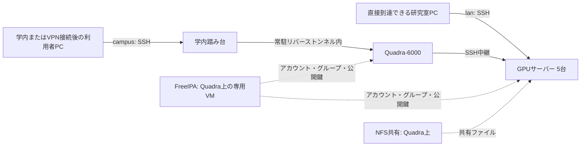

# システム全体と接続経路の選び方

この基盤は、**Quadra-6000を中核に、5台のGPUサーバーで共通のアカウントと共有ストレージを使う構成**です。利用者は、自分の利用許可と接続元ネットワークに合わせて `-lan`・`-campus` を選びます。

`rtx5090-lan` と `rtx5090-campus` は、同じRTX5090へ異なる経路で接続するための名前です。末尾を変えても、別のGPUや研究環境になるわけではありません。接続名はPCのSSH configに登録する別名で、設定前から使えるインターネットのホスト名ではありません。

## 1. 全体構成

実線は利用者のSSH接続経路、点線はサーバーが使う認証情報・共有ストレージを表します。


```mermaid
flowchart LR
    LAN[直接到達できる研究室PC] -->|lan: SSH| GPU[GPUサーバー 5台]
    CAMPUS[学内またはVPN接続後の利用者PC] -->|campus: SSH| JUMP[学内踏み台]
    JUMP -->|常駐リバーストンネル内| Q[Quadra-6000]
    Q -->|SSH中継| GPU
    IPA[FreeIPA: Quadra上の専用VM] -.->|アカウント・グループ・公開鍵| Q
    IPA -.->|アカウント・グループ・公開鍵| GPU
    NFS[NFS共有: Quadra上] -.->|共有ファイル| GPU
```

| 構成要素 | 役割 | 利用者に関係すること |
| --- | --- | --- |
| 学内踏み台 `www.ic.kanazawa-it.ac.jp` | `-campus` の入口 | 中継専用 `campus-relay` への本人の公開鍵登録が必要 |
| Quadra-6000 `quadra.i2lab.test` | SSH中継、NFS共有、FreeIPA VMのホスト | `-campus` が経由する |
| FreeIPA `ipa.i2lab.test` | 利用者名・グループ・UID/GID・SSH公開鍵を一元管理 | 管理者が公開鍵を本人のアカウントへ登録。Quadra・GPUはSSSDという仕組みで参照する |
| GPUサーバー5台 | GPU計算、研究環境・コンテナの実行 | 承認されたサーバーへ本人のFreeIPAアカウントでログインする |
| NFS共有 | Quadraのファイルを各GPUから利用する | GPU上では通知された `/mnt/nfs-shared/...` を使用する |

FreeIPAはSSHの中継先ではありません。利用者がFreeIPAサーバーへログインしてからGPUへ移動する必要はありません。

## 2. どの経路を選ぶか

| 比較項目 | `-lan` | `-campus` |
| --- | --- | --- |
| 接続元の条件 | 対象GPUのSSHへ直接通信できる | 学内踏み台のSSHへ通信できる |
| 経路 | PC → GPU | PC → 学内踏み台 → トンネル → Quadra → GPU |
| 必要な登録 | 本人のFreeIPAアカウント・SSH公開鍵 | 本人のFreeIPAアカウント・SSH公開鍵、踏み台への公開鍵登録 |
| SSH設定 | 対象GPUの `-lan` | `campus-jump`、`quadra-campus`、対象GPUの `-campus` |
| 詳細手順 | [直接接続](lan-user-guide.md) | [踏み台経由](campus-user-guide.md) |

学外では先に[remote-VPN利用案内](https://uranus.mars.kanazawa-it.ac.jp/dpc/navi_network/navi_network_5/)に従いVPNへ接続します。VPNから各SSH先への到達性はネットワーク条件によります。

## 3. `-campus`：学内踏み台とリバーストンネル

踏み台（`www.ic.kanazawa-it.ac.jp`）には、中継専用アカウント `campus-relay` を設けています。このアカウントではシェルへのログインやコマンド実行を禁止し、QuadraのSSH入口（踏み台内部の `127.0.0.1:2222`）への通信中継だけを許可します。利用者ごとの公開鍵を踏み台に登録し、中継を利用する際にも本人の鍵で公開鍵認証を行います。踏み台ユーザー名は共通ですが、秘密鍵は共有しません。

踏み台と中沢研究室のQuadraは、専用のSSH鍵を使ったリバースSSHトンネルで接続されています。利用者はこのトンネルを通り、Quadra、さらにGPUサーバーへ接続します。

研究室内ではFreeIPAで利用者のアカウント・公開鍵・グループを一元管理し、Quadraや各GPUサーバーがその情報を参照して本人を認証します。これにより、**利用者は共通の研究室アカウントで、利用を許可されたGPUサーバーへアクセスできます。** ここで「共通」とは、本人のアカウントを複数サーバーで使える意味で、利用者全員が同じ研究室アカウントを共有する意味ではありません。

設定後、自分のPCで `ssh rtx5090-campus` を実行すると、SSHが次の中継を自動で行います。

```text
自分のPC
  → campus-jump：学内踏み台のSSH（campus-relay、本人の鍵で認証）
  → 踏み台内部の 127.0.0.1:2222
  → 常駐トンネルを通ってQuadraのSSH（本人のFreeIPAユーザー名）
  → RTX5090のSSH（本人のFreeIPAユーザー名）
```

このトンネルを作る接続は、管理者の設定で **Quadra → 学内踏み台** の向きに張られています。踏み台側の入口 `127.0.0.1:2222` に来た通信を、その接続を通してQuadra側の `127.0.0.1:22` へ戻すため、「リバーストンネル」と呼びます。利用者がGPUへ進む向きと、トンネルを張る接続の向きは異なります。

`quadra-campus` の `HostName 127.0.0.1` と `Port 2222` は、**ProxyJump先の学内踏み台から見た宛先**です。自分のPCの2222番ポートではありません。GPUのIPやQuadraのIPへ書き換えないでください。`HostKeyAlias 192.168.73.98` は、このトンネルの接続先をQuadraのホスト鍵として照合するための設定です。

利用者は `ssh -R` の実行やサービスの起動を行いません。管理者がQuadraの `campus-tunnel.service` を維持します。トンネル維持用の専用鍵は利用者のSSH鍵とは別で、配布されません。

踏み台とFreeIPAは別のアカウント管理です。同じ本人の公開鍵を使う場合でも、管理者による両方への登録が必要です。踏み台の `User` には `campus-relay`、Quadra・GPUの `User` には確定したFreeIPAユーザー名を設定します。

[学内用SSH設定例](../config/ssh_config.campus.example)に従えば、自分のPCから1回のコマンドで対象GPUへ接続できます。途中のサーバーへ手動ログインして次の `ssh` を打つ必要はありません。秘密鍵のコピーや `ssh -A` によるエージェント転送も不要です。

## 4. 学外からのremote-VPN接続

学外・自宅からは大学の[remote-VPN利用案内](https://uranus.mars.kanazawa-it.ac.jp/dpc/navi_network/navi_network_5/)に従ってVPNへ接続します。その後、接続先へ直接到達できれば `-lan`、学内踏み台へ到達できれば `-campus` を使います。VPN接続だけではSSHの利用許可は付与されません。どちらにも到達できない場合は、接続元とエラーを管理者へ連絡してください。

## 5. 接続先と共有ファイル

| 管理名 | ホスト名 | IPアドレス | GPU接続名の先頭 |
| --- | --- | --- | --- |
| Quadra-6000（中核・中継） | `quadra.i2lab.test` | `192.168.73.98` | `quadra` |
| RTX-A6000x2 | `a6000.i2lab.test` | `192.168.73.83` | `rtx-a6000x2` |
| AIsawa（RTX 6000 Ada搭載） | `aisawaminori.i2lab.test` | `192.168.73.213` | `aisawa` |
| RTX-6000ada | `rtx6000ada.i2lab.test` | `192.168.73.239` | `rtx-6000ada` |
| RTX4090 | `rtx4090.i2lab.test` | `192.168.73.134` | `rtx4090` |
| RTX5090 | `rtx5090.i2lab.test` | `192.168.73.163` | `rtx5090` |

接続名の先頭に `-lan`・`-campus` を付けて使います。全台の利用が自動的に許可されるわけではありません。設定の正本は上記2つのSSH設定例です。

FreeIPAでアカウントが共通でも、各GPUのローカルファイルがすべて同期されるわけではありません。共有されるのはNFSの指定領域です。例えば `labusers` が許可されている場合、GPU上の `/mnt/nfs-shared/labusers` は、Quadra上の `/srv/nfs/shared/labusers` に対応します。保存先・グループ・Dockerの利用可否は管理者の通知に従います。操作は[共有領域の確認手順](campus-user-guide.md#64-許可された保存先の確認)を参照してください。

Quadraの停止は `-campus` の入口だけでなく、NFS共有とFreeIPAのオンライン参照にも影響します。`-lan` へ切り替えてGPUに直接届く場合も、共有領域や認証が通常どおり使えるとは限りません。

### GPUサーバー上のDocker環境

5台のGPUサーバーでは、FreeIPAの `labusers` または `go2poc` に所属する承認済み利用者が、sudoなしでDockerを操作する構成です。利用者はGPUへSSH接続した後、研究に必要なイメージからコンテナを起動します。接続経路が `-lan`・`-campus` のどちらでも、接続後のDocker利用手順は共通です。

Docker環境はサーバー上で共有され、操作権限は実質root相当です。他人のコンテナや監視サービスを変更せず、GPU・ポート・保存先・利用期間を調整して利用してください。FreeIPAで本人のアカウントが共通でも、コンテナ内のユーザーやファイル権限、研究用イメージは別途設定・確認が必要です。

[Docker利用ガイド](docker-user-guide.md)に、利用確認、研究環境の準備、NFSへの保存、共同利用上の注意と参照元をまとめています。

## 6. 接続確認の見方

例としてRTX5090が許可されている場合、**利用する経路の行だけ**を自分のPCで実行します。

```bash
# 直接到達できる場所から
ssh rtx5090-lan 'hostname -f; whoami; nvidia-smi'

# 学内踏み台経由：先に中継先を確認
ssh quadra-campus 'hostname -f; whoami'
ssh rtx5090-campus 'hostname -f; whoami; nvidia-smi'

```

初回のホスト鍵のFingerPrint（指紋）は管理者からの通知と照合します。Quadraでは `quadra.i2lab.test`、RTX5090では `rtx5090.i2lab.test` と本人のFreeIPAユーザー名が期待値です。`nvidia-smi` はGPU認識の確認であり、研究プログラムの動作確認は別途必要です。

| 失敗した段階 | 確認するところ |
| --- | --- |
| `-campus` の踏み台へ届かない | 接続元ネットワーク、踏み台名、TCP/22の到達性 |
| `127.0.0.1:2222` が接続拒否 | 管理者へQuadraのトンネル稼働確認を依頼 |
| SSHで `Permission denied (publickey)` | 拒否されたホストのユーザー名・鍵指定・公開鍵登録。campusは踏み台の登録も対象 |
| Quadraは成功、GPUは失敗 | 対象GPUの利用許可、接続名、GPU側の認証と稼働状況 |

## 7. 構成の参照元と確認範囲

2026-09-11に、派生元の非公開リポジトリ [nakalab/summer-server-infrastructure](https://github.com/nakalab/summer-server-infrastructure) の `main`（コミット `c5275616296f9b180677fe7b542de4ef02fbff55`）を読み取り、本書と設定例を照合しました。参照元の閲覧には権限が必要ですが、利用に必要な説明はこのガイドに記載しています。

- [構成・サーバー台帳・認証・共有ストレージ](https://github.com/nakalab/summer-server-infrastructure/blob/c5275616296f9b180677fe7b542de4ef02fbff55/README.md)
- [学内トンネルの構成](https://github.com/nakalab/summer-server-infrastructure/blob/c5275616296f9b180677fe7b542de4ef02fbff55/docs/campus-access-guide.md)
- [常駐トンネルのSSH設定](https://github.com/nakalab/summer-server-infrastructure/blob/c5275616296f9b180677fe7b542de4ef02fbff55/config/campus-tunnel.ssh_config)
- [学内接続の設定例](https://github.com/nakalab/summer-server-infrastructure/blob/c5275616296f9b180677fe7b542de4ef02fbff55/config/ssh_config.campus.example)
- [参照元の当時の設定例](https://github.com/nakalab/summer-server-infrastructure/blob/c5275616296f9b180677fe7b542de4ef02fbff55/config/ssh_config.example)

上記は構成資料・設定ファイルの照合です。中継専用 `campus-relay` の説明は、管理者から通知された運用構成を反映しています。2026-09-11に利用者から共有された端末出力では、旧踏み台ユーザー `pi` を経由したQuadra・RTX5090への接続と、RTX5090の `nvidia-smi` によるGPU認識を確認しました。これは `campus-relay` での接続やシェル・コマンド実行の禁止を検証した結果ではありません。今後の接続には `campus-relay` を使用し、本人のPCと登録済みの鍵で利用開始を確認してください。
